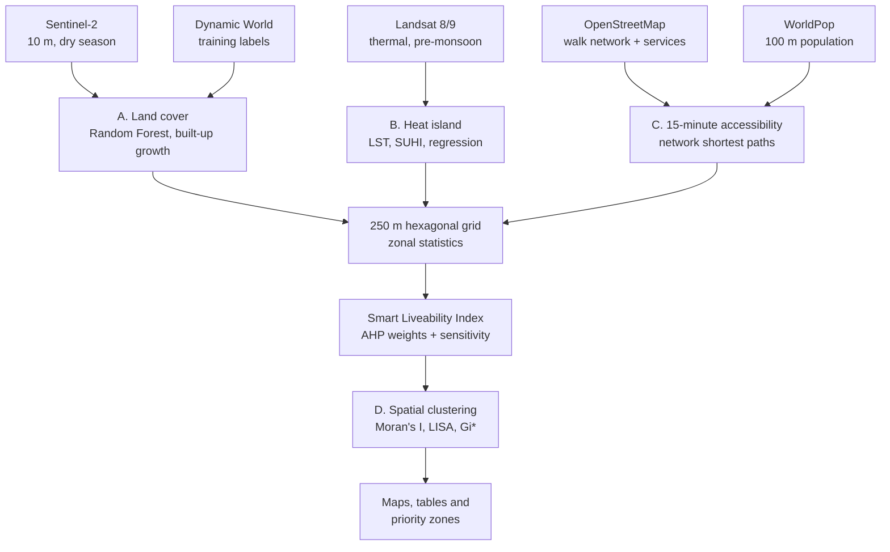

# Smart Cities and Urban Analytics Using Spatial Data — New Town Kolkata

Term project for the **Geographic Information Systems** course at **IIT Kharagpur**.

An open-data GIS framework that measures how liveable a planned Indian smart city is,
using **New Town Kolkata** as the case. It combines satellite remote sensing,
street-network analysis and spatial statistics on a common 250 m hexagonal grid and
condenses them into a **Smart Liveability Index (SLI)**.

## Research questions

1. **RQ1:** How much has built-up area grown since 2016, and what land covers did it replace?
2. **RQ2:** How strongly is land surface temperature associated with built-up density and vegetation?
3. **RQ3:** What share of residents can reach five essential services within a 15-minute walk?
4. **RQ4:** Are liveability deficits spatially clustered, and where are the hot spots?

## Workflow



| Module | Method | Data |
| --- | --- | --- |
| A — Land cover | Random Forest (100 trees) on Sentinel-2 bands + NDVI/NDBI/MNDWI, trained on high-confidence Dynamic World pixels; transition matrix | Sentinel-2, Dynamic World, ESA WorldCover (check) |
| B — Heat island | Landsat C2 L2 surface temperature, surface UHI intensity, UTFVI, OLS of LST on spectral indices | Landsat 8/9 |
| C — Accessibility | OSMnx walk network, multi-source Dijkstra to schools, health, parks, transit and shops; 15 min = 1,200 m | OpenStreetMap, WorldPop |
| D — Index and clustering | AHP-weighted SLI (CR < 0.10), ±20% weight sensitivity, Global Moran's I, LISA and Getis-Ord Gi* with FDR control | Outputs of A–C |

## Quick start 

1. Register a free Earth Engine Cloud project for non-commercial use:
   https://code.earthengine.google.com/register
2. Click **Open in Colab** above (or upload `notebooks/newtown_smart_city_analysis.ipynb`).
3. In the configuration cell, set `PROJECT_ID` to your Earth Engine project ID.
4. *Optional:* upload a digitised boundary GeoJSON and set `BOUNDARY_FILE` (see [`data/README.md`](data/README.md)).
5. **Runtime → Run all.** A zip of every output downloads at the end.

### Running locally

```bash
python -m venv .venv && source .venv/bin/activate
pip install -r requirements.txt
earthengine authenticate
cd notebooks && jupyter lab newtown_smart_city_analysis.ipynb
```

## Outputs

Everything is written to `outputs/` (git-ignored):

| Path | Contents |
| --- | --- |
| `outputs/results.md` | All results tables in the report's Section 7 layout |
| `outputs/tables/*.csv` | Accuracy, F1, areas, transition matrix, LST/UHI, OLS, accessibility, AHP, sensitivity, clustering |
| `outputs/figures/*.png` | Study area, land-cover maps, built-up change, LST, NDVI–LST scatter, service distances, 15-minute score, SLI quintiles, LISA and Gi* maps |
| `outputs/data/hex_results.gpkg` | Hexagon layer with every indicator, the SLI and cluster labels (open in QGIS) |

## Repository structure

```
newtown-smart-city-gis/
├── notebooks/
│   └── newtown_smart_city_analysis.ipynb   # run this
├── src/
│   └── newtown_smart_city_analysis.py      # same notebook as a plain script (jupytext py:percent)
├── tests/
│   └── test_helpers.py                     # offline tests for grid, AHP, SLI, FDR, clustering, maps
├── data/README.md                          # optional boundary inputs and data licences
├── docs/README.md                          # where the written report goes
├── outputs/                                # generated results (git-ignored)
├── .github/workflows/tests.yml             # CI: tests + notebook/script sync check
├── requirements.txt
└── LICENSE
```

## Development

The notebook and `src/` script are paired with jupytext. After editing either one:

```bash
jupytext --sync notebooks/newtown_smart_city_analysis.ipynb   # or edit the .py and run:
jupytext --to ipynb src/newtown_smart_city_analysis.py -o notebooks/newtown_smart_city_analysis.ipynb
pytest -q
```

The tests exercise everything that does not need network access (hexagon grid,
AHP, index, sensitivity analysis, Benjamini–Hochberg correction, spatial statistics
and map rendering) on synthetic data. Earth Engine and OpenStreetMap steps are
exercised only when the notebook runs.

## Limitations

- **Accuracy is relative to Dynamic World.** Training and validation labels come from Dynamic World, so accuracy measures agreement with that product, not field truth. ESA WorldCover 2021 is reported as an independent comparison.
- **Boundary.** Without a digitised NKDA boundary, the fallback bounding box (~75 km²) includes areas outside New Town (~30 km²).
- **LST** is daytime surface temperature (~10:30 a.m. overpass) at native 100 m thermal resolution, not air temperature.
- **OSM completeness** varies, and WorldPop is modelled population.
- **AHP weights** reflect the group's judgement; the sensitivity analysis reports how much the ranking depends on them.


## Key references

- Anselin, L. (1995). Local indicators of spatial association — LISA. *Geographical Analysis*, 27(2), 93–115.
- Boeing, G. (2017). OSMnx. *Computers, Environment and Urban Systems*, 65, 126–139.
- Brown, C. F., et al. (2022). Dynamic World. *Scientific Data*, 9, 251.
- Getis, A., & Ord, J. K. (1992). *Geographical Analysis*, 24(3), 189–206.
- Gorelick, N., et al. (2017). Google Earth Engine. *Remote Sensing of Environment*, 202, 18–27.
- Moreno, C., et al. (2021). Introducing the "15-minute city". *Smart Cities*, 4(1), 93–111.
- Saaty, T. L. (1980). *The Analytic Hierarchy Process*. McGraw-Hill.

The full reference list is in the report (see [`docs/README.md`](docs/README.md)).

## License

Code: MIT (see [`LICENSE`](LICENSE)). Data remain under their original licences (see [`data/README.md`](data/README.md)).
